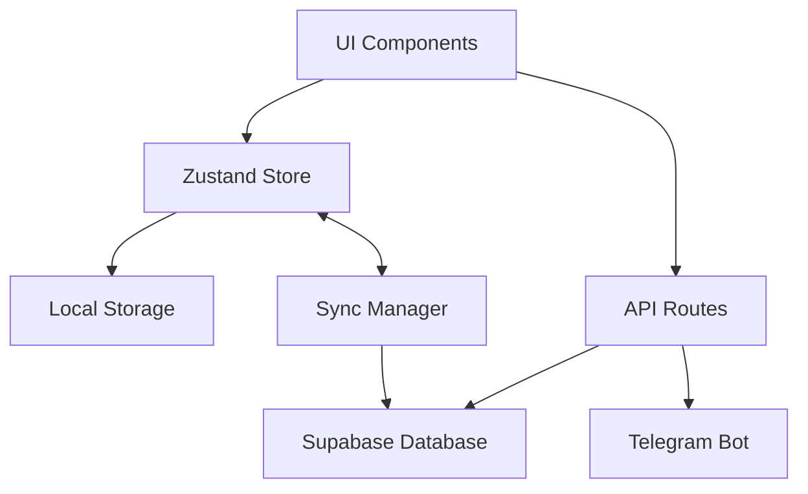

# Design Document

## Overview

Функциональность "Группы" в разделе "Сообщество VibeStudy" представляет собой систему для создания и управления учебными группами. Пользователи могут создавать группы, присоединяться к существующим, общаться в групповом чате и совместно изучать программирование.

Дизайн следует существующей архитектуре VibeStudy с использованием Next.js App Router, Zustand для управления состоянием, Supabase для хранения данных и Telegram для уведомлений.

## Architecture

### High-Level Architecture



### Technology Stack

- **Frontend**: Next.js 14 (App Router), React 18, TypeScript
- **State Management**: Zustand с persist middleware
- **Database**: Supabase (PostgreSQL)
- **Real-time**: Supabase Realtime для чата
- **Authentication**: Supabase Auth (существующая система)
- **UI Components**: Radix UI, TailwindCSS, Framer Motion
- **Notifications**: Telegram Bot API

## Components and Interfaces

### 1. Database Schema

```sql
-- Groups table
CREATE TABLE groups (
  id UUID PRIMARY KEY DEFAULT uuid_generate_v4(),
  name VARCHAR(50) NOT NULL,
  description VARCHAR(500) NOT NULL,
  language_id VARCHAR(20) NOT NULL,
  owner_id UUID NOT NULL REFERENCES auth.users(id) ON DELETE CASCADE,
  member_count INTEGER DEFAULT 1,
  created_at TIMESTAMP WITH TIME ZONE DEFAULT NOW(),
  updated_at TIMESTAMP WITH TIME ZONE DEFAULT NOW()
);

-- Group members table
CREATE TABLE group_members (
  id UUID PRIMARY KEY DEFAULT uuid_generate_v4(),
  group_id UUID NOT NULL REFERENCES groups(id) ON DELETE CASCADE,
  user_id UUID NOT NULL REFERENCES auth.users(id) ON DELETE CASCADE,
  joined_at TIMESTAMP WITH TIME ZONE DEFAULT NOW(),
  is_online BOOLEAN DEFAULT false,
  last_seen TIMESTAMP WITH TIME ZONE DEFAULT NOW(),
  UNIQUE(group_id, user_id)
);

-- Group messages table
CREATE TABLE group_messages (
  id UUID PRIMARY KEY DEFAULT uuid_generate_v4(),
  group_id UUID NOT NULL REFERENCES groups(id) ON DELETE CASCADE,
  user_id UUID NOT NULL REFERENCES auth.users(id) ON DELETE CASCADE,
  content VARCHAR(1000) NOT NULL,
  created_at TIMESTAMP WITH TIME ZONE DEFAULT NOW()
);

-- Indexes
CREATE INDEX idx_groups_language ON groups(language_id);
CREATE INDEX idx_groups_owner ON groups(owner_id);
CREATE INDEX idx_group_members_group ON group_members(group_id);
CREATE INDEX idx_group_members_user ON group_members(user_id);
CREATE INDEX idx_group_messages_group ON group_messages(group_id);
CREATE INDEX idx_group_messages_created ON group_messages(created_at DESC);
```

### 2. TypeScript Types

```typescript
// src/types/groups.ts

export interface Group {
  id: string;
  name: string;
  description: string;
  languageId: string;
  ownerId: string;
  memberCount: number;
  createdAt: string;
  updatedAt: string;
}

export interface GroupMember {
  id: string;
  groupId: string;
  userId: string;
  joinedAt: string;
  isOnline: boolean;
  lastSeen: string;
  user?: {
    id: string;
    name: string;
    avatar: string;
  };
}

export interface GroupMessage {
  id: string;
  groupId: string;
  userId: string;
  content: string;
  createdAt: string;
  user?: {
    id: string;
    name: string;
    avatar: string;
  };
}

export interface GroupWithMembership extends Group {
  isMember: boolean;
  isOwner: boolean;
}
```

### 3. Zustand Store

```typescript
// src/store/groups-store.ts

interface GroupsStore {
  // State
  groups: Group[];
  currentGroup: Group | null;
  members: GroupMember[];
  messages: GroupMessage[];
  isLoading: boolean;
  error: string | null;
  
  // Filters
  searchQuery: string;
  languageFilter: string | null;
  
  // Actions - Groups
  fetchGroups: () => Promise<void>;
  fetchGroupById: (groupId: string) => Promise<void>;
  createGroup: (data: CreateGroupData) => Promise<Group>;
  updateGroup: (groupId: string, data: UpdateGroupData) => Promise<void>;
  deleteGroup: (groupId: string) => Promise<void>;
  
  // Actions - Membership
  joinGroup: (groupId: string) => Promise<void>;
  leaveGroup: (groupId: string) => Promise<void>;
  fetchMembers: (groupId: string) => Promise<void>;
  
  // Actions - Messages
  fetchMessages: (groupId: string) => Promise<void>;
  sendMessage: (groupId: string, content: string) => Promise<void>;
  subscribeToMessages: (groupId: string) => void;
  unsubscribeFromMessages: () => void;
  
  // Actions - Filters
  setSearchQuery: (query: string) => void;
  setLanguageFilter: (languageId: string | null) => void;
  
  // Computed
  getFilteredGroups: () => GroupWithMembership[];
}
```

### 4. Component Structure

```
src/
├── app/
│   └── community/
│       ├── page.tsx                    # Community hub (4 sections)
│       └── groups/
│           ├── page.tsx                # Groups list
│           ├── [groupId]/
│           │   └── page.tsx            # Group detail with chat
│           └── create/
│               └── page.tsx            # Create group form
├── components/
│   └── community/
│       ├── CommunityHub.tsx            # Main hub with 4 sections
│       ├── groups/
│       │   ├── GroupsList.tsx          # List of groups
│       │   ├── GroupCard.tsx           # Group card component
│       │   ├── GroupFilters.tsx        # Search and filters
│       │   ├── CreateGroupDialog.tsx   # Create group modal
│       │   ├── GroupDetail.tsx         # Group info and settings
│       │   ├── GroupChat.tsx           # Chat interface
│       │   ├── GroupMembers.tsx        # Members list
│       │   ├── MessageList.tsx         # Messages display
│       │   ├── MessageInput.tsx        # Message input
│       │   └── GroupSettings.tsx       # Settings for owner
│       └── ui/
│           └── ...                     # Shared UI components
└── lib/
    └── supabase/
        └── groups.ts                   # Supabase queries
```

### 5. API Routes

```typescript
// API endpoints structure

POST   /api/groups              # Create group
GET    /api/groups              # List groups (with filters)
GET    /api/groups/[id]         # Get group details
PATCH  /api/groups/[id]         # Update group
DELETE /api/groups/[id]         # Delete group

POST   /api/groups/[id]/join    # Join group
POST   /api/groups/[id]/leave   # Leave group
GET    /api/groups/[id]/members # Get members

GET    /api/groups/[id]/messages # Get messages
POST   /api/groups/[id]/messages # Send message
```

## Data Models

### Group Model

```typescript
interface CreateGroupData {
  name: string;          // 3-50 characters
  description: string;   // 10-500 characters
  languageId: string;    // python, javascript, etc.
}

interface UpdateGroupData {
  name?: string;
  description?: string;
  languageId?: string;
}
```

### Message Model

```typescript
interface SendMessageData {
  content: string;       // 1-1000 characters
}
```

### Validation Rules

- Group name: 3-50 символов, обязательное
- Group description: 10-500 символов, обязательное
- Message content: 1-1000 символов, обязательное
- Max groups created per user: 3
- Max groups joined per user: 10

## Error Handling

### Error Types

```typescript
enum GroupErrorCode {
  GROUP_NOT_FOUND = 'GROUP_NOT_FOUND',
  UNAUTHORIZED = 'UNAUTHORIZED',
  MAX_GROUPS_CREATED = 'MAX_GROUPS_CREATED',
  MAX_GROUPS_JOINED = 'MAX_GROUPS_JOINED',
  ALREADY_MEMBER = 'ALREADY_MEMBER',
  NOT_MEMBER = 'NOT_MEMBER',
  VALIDATION_ERROR = 'VALIDATION_ERROR',
  DATABASE_ERROR = 'DATABASE_ERROR'
}

interface GroupError {
  code: GroupErrorCode;
  message: string;
  details?: any;
}
```

### Error Handling Strategy

1. **Client-side validation**: Проверка перед отправкой запроса
2. **API validation**: Валидация на сервере с понятными сообщениями
3. **User feedback**: Toast уведомления для пользователя
4. **Error logging**: Логирование ошибок для отладки
5. **Graceful degradation**: Fallback на локальное хранилище при проблемах с сетью

### Error Messages (i18n)

```typescript
// src/lib/i18n/ru/groups.ts
export const groupsErrors = {
  GROUP_NOT_FOUND: 'Группа не найдена',
  UNAUTHORIZED: 'Необходима авторизация',
  MAX_GROUPS_CREATED: 'Вы можете создать максимум 3 группы',
  MAX_GROUPS_JOINED: 'Вы можете состоять максимум в 10 группах',
  ALREADY_MEMBER: 'Вы уже участник этой группы',
  NOT_MEMBER: 'Вы не являетесь участником этой группы',
  VALIDATION_ERROR: 'Ошибка валидации данных',
  DATABASE_ERROR: 'Ошибка базы данных'
};
```

## Testing Strategy

### Unit Tests

- Store actions и reducers
- Validation functions
- Utility functions
- API route handlers

### Integration Tests

- API endpoints с mock database
- Store integration с API
- Real-time subscriptions

### E2E Tests (Playwright)

```typescript
// tests/e2e/groups.spec.ts

test.describe('Groups Feature', () => {
  test('should create a new group', async ({ page }) => {
    // Navigate to community
    // Click create group
    // Fill form
    // Submit
    // Verify group created
  });
  
  test('should join existing group', async ({ page }) => {
    // Navigate to groups list
    // Find group
    // Click join
    // Verify membership
  });
  
  test('should send and receive messages', async ({ page }) => {
    // Open group
    // Send message
    // Verify message appears
  });
  
  test('should leave group', async ({ page }) => {
    // Open group
    // Click leave
    // Confirm
    // Verify left
  });
});
```

### Test Coverage Goals

- Unit tests: 80%+ coverage
- Integration tests: Critical paths
- E2E tests: Main user flows

## UI/UX Design

### Community Hub Layout

```
┌─────────────────────────────────────┐
│  🏠 Сообщество VibeStudy            │
├─────────────────────────────────────┤
│                                     │
│  Выбери раздел:                     │
│                                     │
│  ┌──────────┐  ┌──────────┐        │
│  │ 🏆       │  │ 👥       │        │
│  │ Лидерборд│  │ Группы   │        │
│  └──────────┘  └──────────┘        │
│                                     │
│  ┌──────────┐  ┌──────────┐        │
│  │ 💬       │  │ 🤝       │        │
│  │Обсуждения│  │ Найти    │        │
│  │          │  │напарника │        │
│  └──────────┘  └──────────┘        │
│                                     │
│  ┌──────────────────────────┐      │
│  │ ⬅️ Назад                 │      │
│  └──────────────────────────┘      │
└─────────────────────────────────────┘
```

### Groups List Layout

```
┌─────────────────────────────────────┐
│  👥 Группы                          │
│  [Создать группу]                   │
├─────────────────────────────────────┤
│  🔍 [Поиск...]  [Язык ▼]           │
├─────────────────────────────────────┤
│  ┌───────────────────────────────┐ │
│  │ Python Beginners         👥 12│ │
│  │ Изучаем Python с нуля         │ │
│  │ [Присоединиться]              │ │
│  └───────────────────────────────┘ │
│  ┌───────────────────────────────┐ │
│  │ JS Masters              👥 8  │ │
│  │ Продвинутый JavaScript        │ │
│  │ [Открыть] ✓                   │ │
│  └───────────────────────────────┘ │
└─────────────────────────────────────┘
```

### Group Detail Layout

```
┌─────────────────────────────────────┐
│  ⬅️ Python Beginners          ⚙️   │
├─────────────────────────────────────┤
│  👥 Участники (12)                  │
│  ┌─────────────────────────────┐   │
│  │ 👤 Иван (владелец) 🟢       │   │
│  │ 👤 Мария 🟢                 │   │
│  │ 👤 Петр ⚪                  │   │
│  └─────────────────────────────┘   │
├─────────────────────────────────────┤
│  💬 Чат                             │
│  ┌─────────────────────────────┐   │
│  │ Иван: Привет всем!          │   │
│  │ 12:05                       │   │
│  │                             │   │
│  │ Мария: Привет! Как дела?    │   │
│  │ 12:06                       │   │
│  └─────────────────────────────┘   │
│  [Написать сообщение...]            │
└─────────────────────────────────────┘
```

### Responsive Design

- **Mobile**: Вертикальная компоновка, полноэкранный чат
- **Tablet**: Адаптивная сетка 2 колонки
- **Desktop**: Боковая панель с участниками, основной чат

### Animations

- Framer Motion для плавных переходов
- Анимация появления новых сообщений
- Skeleton loaders при загрузке
- Toast notifications для действий

## Real-time Features

### Supabase Realtime Integration

```typescript
// Subscribe to new messages
const subscription = supabase
  .channel(`group:${groupId}`)
  .on(
    'postgres_changes',
    {
      event: 'INSERT',
      schema: 'public',
      table: 'group_messages',
      filter: `group_id=eq.${groupId}`
    },
    (payload) => {
      // Add new message to store
      addMessage(payload.new);
    }
  )
  .subscribe();

// Subscribe to member status
const memberSubscription = supabase
  .channel(`group_members:${groupId}`)
  .on(
    'postgres_changes',
    {
      event: 'UPDATE',
      schema: 'public',
      table: 'group_members',
      filter: `group_id=eq.${groupId}`
    },
    (payload) => {
      // Update member status
      updateMemberStatus(payload.new);
    }
  )
  .subscribe();
```

### Online Status

- Heartbeat каждые 30 секунд для обновления `last_seen`
- Автоматическое обновление `is_online` при активности
- Отображение статуса в реальном времени

## Integration with Existing Features

### Authentication

- Использование существующей Supabase Auth
- Проверка авторизации перед доступом к группам
- Гостевой режим: показывать заглушку с призывом войти

### Profile

- Отображение групп пользователя в профиле
- Статистика: количество групп, сообщений
- Ссылки на активные группы

### Telegram Bot

- Уведомления о новых сообщениях в группах
- Дайджест активности группы
- Команды для управления группами

### Achievements

- Новые достижения для групп:
  - "Социальный" - создать первую группу
  - "Командный игрок" - присоединиться к 5 группам
  - "Болтун" - отправить 100 сообщений
  - "Лидер сообщества" - группа достигла 20 участников

## Performance Considerations

### Optimization Strategies

1. **Pagination**: Загрузка сообщений порциями (50 за раз)
2. **Virtual scrolling**: Для больших списков сообщений
3. **Debouncing**: Поиск и фильтрация с задержкой
4. **Caching**: Кэширование списка групп в store
5. **Lazy loading**: Загрузка участников по требованию
6. **Optimistic updates**: Мгновенное отображение своих сообщений

### Database Optimization

- Индексы на часто запрашиваемые поля
- Limit на количество возвращаемых записей
- Использование RLS (Row Level Security) в Supabase
- Денормализация `member_count` для быстрого доступа

## Security

### Row Level Security (RLS) Policies

```sql
-- Groups: Anyone can read
CREATE POLICY "Groups are viewable by everyone"
  ON groups FOR SELECT
  USING (true);

-- Groups: Only authenticated users can create
CREATE POLICY "Authenticated users can create groups"
  ON groups FOR INSERT
  WITH CHECK (auth.uid() = owner_id);

-- Groups: Only owner can update
CREATE POLICY "Only owner can update group"
  ON groups FOR UPDATE
  USING (auth.uid() = owner_id);

-- Groups: Only owner can delete
CREATE POLICY "Only owner can delete group"
  ON groups FOR DELETE
  USING (auth.uid() = owner_id);

-- Messages: Only members can read
CREATE POLICY "Only members can read messages"
  ON group_messages FOR SELECT
  USING (
    EXISTS (
      SELECT 1 FROM group_members
      WHERE group_id = group_messages.group_id
      AND user_id = auth.uid()
    )
  );

-- Messages: Only members can send
CREATE POLICY "Only members can send messages"
  ON group_messages FOR INSERT
  WITH CHECK (
    auth.uid() = user_id AND
    EXISTS (
      SELECT 1 FROM group_members
      WHERE group_id = group_messages.group_id
      AND user_id = auth.uid()
    )
  );
```

### Input Validation

- Sanitization всех пользовательских вводов
- XSS protection для сообщений
- Rate limiting на API endpoints
- CSRF protection (встроено в Next.js)

## Internationalization

### Supported Languages

- Русский (по умолчанию)
- Английский

### Translation Keys

```typescript
// src/lib/i18n/ru/groups.ts
export const groups = {
  title: 'Группы',
  createGroup: 'Создать группу',
  joinGroup: 'Присоединиться',
  leaveGroup: 'Покинуть группу',
  deleteGroup: 'Удалить группу',
  members: 'Участники',
  chat: 'Чат',
  settings: 'Настройки',
  // ... more keys
};
```

## Migration Strategy

### Phase 1: Core Features
- Database schema
- Basic CRUD operations
- Groups list and detail pages

### Phase 2: Real-time Chat
- Message sending/receiving
- Real-time updates
- Online status

### Phase 3: Polish
- Animations and transitions
- Telegram integration
- Achievements
- Performance optimization

### Rollout Plan

1. Deploy database schema
2. Deploy API routes
3. Deploy UI components
4. Enable for beta users
5. Monitor and fix issues
6. Full rollout
