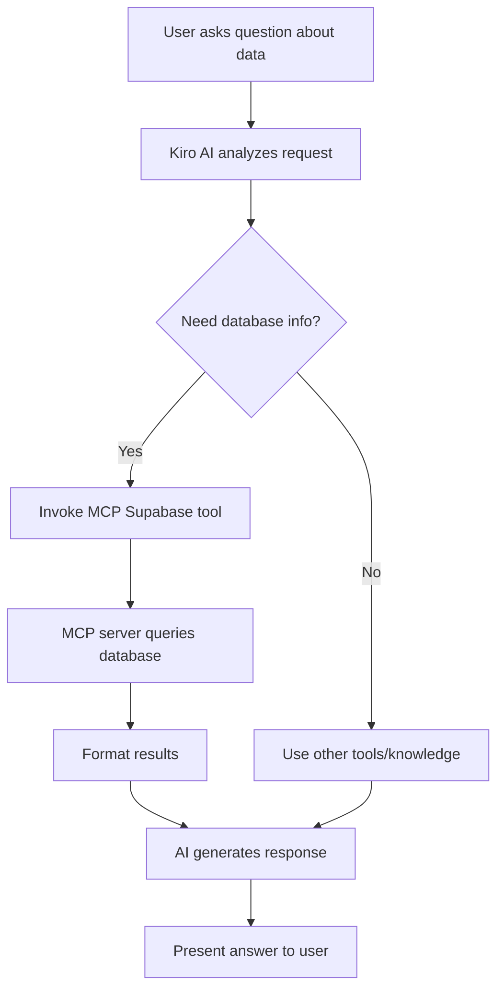

# Design Document

## Overview

This document describes the design for integrating the Supabase MCP (Model Context Protocol) server into the VibeStudy platform. The integration will enable AI assistants to interact with the Supabase PostgreSQL database through standardized MCP tools, providing capabilities for schema inspection, data querying, and database operations without requiring manual SQL writing.

## Architecture

### High-Level Architecture

```
┌─────────────────┐
│   Kiro AI       │
│   Assistant     │
└────────┬────────┘
         │ MCP Protocol
         ▼
┌─────────────────┐
│  Supabase MCP   │
│     Server      │
│  (@modelcontext │
│  protocol/      │
│  server-        │
│  supabase)      │
└────────┬────────┘
         │ PostgreSQL Protocol
         ▼
┌─────────────────┐
│   Supabase      │
│   PostgreSQL    │
│   Database      │
└─────────────────┘
```

### Component Interaction Flow

1. **AI Assistant Request**: Kiro AI needs database information or wants to execute a query
2. **MCP Tool Invocation**: AI calls appropriate MCP tool (e.g., `supabase_query`, `supabase_get_schema`)
3. **MCP Server Processing**: Supabase MCP server validates request and constructs database operation
4. **Database Execution**: MCP server executes operation against Supabase PostgreSQL
5. **Response Formatting**: MCP server formats database response into structured MCP response
6. **AI Processing**: Kiro AI receives structured data and uses it to assist the user

## Components and Interfaces

### 1. MCP Configuration Component

**File**: `.mcp.json`

**Purpose**: Define and configure available MCP servers for the AI assistant

**Structure**:
```json
{
  "mcpServers": {
    "shadcn": {
      "command": "npx",
      "args": ["shadcn@latest", "mcp"]
    },
    "supabase": {
      "command": "npx",
      "args": ["-y", "@modelcontextprotocol/server-supabase"],
      "env": {
        "SUPABASE_URL": "${SUPABASE_URL}",
        "SUPABASE_SERVICE_ROLE_KEY": "${SUPABASE_SERVICE_ROLE_KEY}"
      }
    }
  }
}
```

**Key Design Decisions**:
- Use `npx -y` to automatically accept package installation without prompting
- Reference environment variables using `${VAR_NAME}` syntax for security
- Keep existing `shadcn` server configuration intact
- Server name `supabase` is descriptive and follows naming conventions

### 2. Environment Configuration Component

**File**: `.env.local`

**Purpose**: Store sensitive database credentials securely

**Required Variables**:
```bash
# Supabase Configuration (existing)
NEXT_PUBLIC_SUPABASE_URL=https://your-project.supabase.co
NEXT_PUBLIC_SUPABASE_ANON_KEY=your_anon_key
SUPABASE_SERVICE_ROLE_KEY=your_service_role_key

# MCP Supabase (uses existing variables)
SUPABASE_URL=${NEXT_PUBLIC_SUPABASE_URL}
```

**Key Design Decisions**:
- Reuse existing `NEXT_PUBLIC_SUPABASE_URL` for `SUPABASE_URL` to avoid duplication
- Use `SUPABASE_SERVICE_ROLE_KEY` for MCP server (bypasses RLS for admin operations)
- Keep credentials in `.env.local` (gitignored) for security
- Update `.env.local.example` with MCP-specific comments

### 3. MCP Tool Interface

**Available Tools**:

#### Tool: `supabase_query`
```typescript
interface SupabaseQueryTool {
  name: "supabase_query";
  description: "Execute SQL queries against the Supabase database";
  inputSchema: {
    type: "object";
    properties: {
      query: {
        type: "string";
        description: "SQL query to execute";
      };
      params?: {
        type: "array";
        description: "Optional query parameters for parameterized queries";
      };
    };
    required: ["query"];
  };
}
```

**Use Cases**:
- Retrieve user progress: `SELECT * FROM user_progress WHERE user_id = $1`
- Analyze achievements: `SELECT achievement_id, COUNT(*) FROM user_achievements GROUP BY achievement_id`
- Get learning statistics: `SELECT topic, AVG(mastery_level) FROM topic_mastery GROUP BY topic`

#### Tool: `supabase_get_schema`
```typescript
interface SupabaseGetSchemaTool {
  name: "supabase_get_schema";
  description: "Retrieve database schema information";
  inputSchema: {
    type: "object";
    properties: {
      table_name?: {
        type: "string";
        description: "Optional table name to get schema for specific table";
      };
    };
  };
}
```

**Use Cases**:
- Understand database structure before writing queries
- Validate table and column names
- Discover relationships between tables

#### Tool: `supabase_list_tables`
```typescript
interface SupabaseListTablesTool {
  name: "supabase_list_tables";
  description: "List all tables in the database";
  inputSchema: {
    type: "object";
    properties: {};
  };
}
```

**Use Cases**:
- Discover available data sources
- Validate table existence
- Explore database structure

#### Tool: `supabase_get_table_info`
```typescript
interface SupabaseGetTableInfoTool {
  name: "supabase_get_table_info";
  description: "Get detailed information about a specific table";
  inputSchema: {
    type: "object";
    properties: {
      table_name: {
        type: "string";
        description: "Name of the table to get information about";
      };
    };
    required: ["table_name"];
  };
}
```

**Use Cases**:
- Understand column types and constraints
- Check indexes for query optimization
- Review foreign key relationships

## Data Models

### Database Schema (Existing)

The MCP server will interact with the following tables:

```sql
-- Core Tables
users (id, username, email, created_at, updated_at)
user_progress (id, user_id, topic_id, completed, score, time_spent, last_accessed)
task_attempts (id, user_id, task_id, code, result, is_correct, hints_used, time_spent)
user_achievements (id, user_id, achievement_id, unlocked_at)
topic_mastery (id, user_id, topic, mastery_level, total_attempts, successful_attempts)
generated_content_cache (id, content_type, topic, difficulty, language, content, expires_at)
```

### MCP Response Format

All MCP tools return responses in the following format:

```typescript
interface MCPResponse {
  content: Array<{
    type: "text" | "resource";
    text?: string;
    resource?: {
      uri: string;
      mimeType: string;
      text: string;
    };
  }>;
  isError?: boolean;
}
```

**Example Query Response**:
```json
{
  "content": [
    {
      "type": "text",
      "text": "Query executed successfully. Results:\n[\n  {\"id\": \"123\", \"username\": \"user1\", \"email\": \"user1@example.com\"},\n  {\"id\": \"456\", \"username\": \"user2\", \"email\": \"user2@example.com\"}\n]"
    }
  ]
}
```

**Example Schema Response**:
```json
{
  "content": [
    {
      "type": "text",
      "text": "Schema for table 'users':\n- id: UUID (PRIMARY KEY)\n- username: TEXT (UNIQUE, NOT NULL)\n- email: TEXT (UNIQUE)\n- created_at: TIMESTAMP WITH TIME ZONE\n- updated_at: TIMESTAMP WITH TIME ZONE"
    }
  ]
}
```

## Error Handling

### Error Categories

1. **Configuration Errors**
   - Missing environment variables
   - Invalid Supabase URL or credentials
   - MCP server installation failures

2. **Query Errors**
   - SQL syntax errors
   - Invalid table or column names
   - RLS policy violations
   - Permission denied errors

3. **Connection Errors**
   - Database connection timeout
   - Network failures
   - Supabase service unavailable

### Error Handling Strategy

```typescript
interface ErrorHandlingStrategy {
  configurationErrors: {
    detection: "Check environment variables on MCP server startup";
    response: "Return clear error message with missing variable names";
    recovery: "Provide instructions to set required environment variables";
  };
  
  queryErrors: {
    detection: "Catch PostgreSQL error codes and messages";
    response: "Return formatted error with SQL error details";
    recovery: "Suggest query corrections based on error type";
  };
  
  connectionErrors: {
    detection: "Monitor connection timeouts and network errors";
    response: "Return connection error with retry suggestion";
    recovery: "Implement exponential backoff for retries";
  };
}
```

### Error Response Format

```json
{
  "content": [
    {
      "type": "text",
      "text": "Error: [Error Category]\nDetails: [Specific error message]\nSuggestion: [How to fix]"
    }
  ],
  "isError": true
}
```

## Testing Strategy

### 1. Configuration Testing

**Objective**: Verify MCP server is properly configured and can connect to Supabase

**Test Cases**:
- [ ] MCP server appears in available tools list
- [ ] Environment variables are correctly loaded
- [ ] Connection to Supabase database succeeds
- [ ] Service role key has appropriate permissions

**Testing Approach**:
```
1. Add Supabase MCP server to .mcp.json
2. Set environment variables in .env.local
3. Restart Kiro AI assistant
4. Ask AI: "List all available MCP tools"
5. Verify "supabase_query", "supabase_get_schema", etc. appear in list
```

### 2. Schema Inspection Testing

**Objective**: Verify AI can retrieve and understand database schema

**Test Cases**:
- [ ] List all tables returns correct table names
- [ ] Get schema for specific table returns columns and types
- [ ] Schema includes foreign key relationships
- [ ] Schema includes index information

**Testing Approach**:
```
1. Ask AI: "What tables are in the database?"
2. Verify response includes: users, user_progress, task_attempts, etc.
3. Ask AI: "What columns does the user_progress table have?"
4. Verify response includes: id, user_id, topic_id, completed, score, etc.
```

### 3. Query Execution Testing

**Objective**: Verify AI can execute queries and retrieve data

**Test Cases**:
- [ ] Simple SELECT query returns data
- [ ] JOIN query across tables works correctly
- [ ] Aggregate queries (COUNT, AVG, SUM) return correct results
- [ ] Parameterized queries prevent SQL injection

**Testing Approach**:
```
1. Ask AI: "Show me the latest 5 user achievements"
2. Verify query executes and returns results
3. Ask AI: "What's the average mastery level for Python topics?"
4. Verify aggregate query returns numeric result
```

### 4. Security Testing

**Objective**: Verify RLS policies are enforced and credentials are secure

**Test Cases**:
- [ ] Service role key bypasses RLS for admin operations
- [ ] Credentials are not exposed in logs or responses
- [ ] Invalid credentials return appropriate error
- [ ] SQL injection attempts are prevented

**Testing Approach**:
```
1. Verify .env.local is in .gitignore
2. Check MCP responses don't include credentials
3. Attempt query with malicious SQL input
4. Verify parameterized queries are used
```

### 5. Error Handling Testing

**Objective**: Verify errors are caught and reported clearly

**Test Cases**:
- [ ] Invalid SQL syntax returns clear error message
- [ ] Non-existent table returns helpful error
- [ ] Connection timeout is handled gracefully
- [ ] Missing environment variables are reported on startup

**Testing Approach**:
```
1. Ask AI to query non-existent table
2. Verify error message is clear and helpful
3. Temporarily remove SUPABASE_URL from .env.local
4. Restart and verify configuration error is reported
```

## Integration Points

### 1. Existing Supabase Client Integration

The MCP server operates independently from the existing Next.js Supabase client:

```typescript
// Existing: src/lib/supabase/client.ts
// Used by: Frontend components, API routes
// Auth context: User session (anon key)

// New: MCP Supabase Server
// Used by: AI assistant
// Auth context: Service role (admin access)
```

**Key Difference**: MCP server uses service role key for admin-level access, while frontend uses anon key with RLS.

### 2. AI Assistant Workflow Integration



### 3. Monitoring and Logging

**MCP Server Logs**:
- Query execution time
- Error occurrences
- Tool invocation frequency

**Integration with Existing Analytics**:
- Track AI-assisted data queries
- Monitor database performance impact
- Identify common query patterns

## Security Considerations

### 1. Credential Management

- **Service Role Key**: Stored in `.env.local`, never committed to git
- **Environment Variable Injection**: MCP config references variables, not hardcoded values
- **Access Control**: Service role key has full database access, used only by trusted AI assistant

### 2. Query Safety

- **Parameterized Queries**: Use `$1, $2` placeholders to prevent SQL injection
- **Query Validation**: MCP server validates SQL syntax before execution
- **Read-Only Preference**: Prefer SELECT queries, limit INSERT/UPDATE/DELETE operations

### 3. RLS Policy Enforcement

- **Service Role Bypass**: MCP server bypasses RLS for admin operations
- **Context Awareness**: AI should understand RLS policies when suggesting queries
- **Audit Trail**: All queries logged for security review

### 4. Rate Limiting

- **MCP Tool Invocation**: Limit number of queries per minute
- **Query Complexity**: Monitor and limit expensive queries
- **Connection Pooling**: Reuse database connections efficiently

## Performance Considerations

### 1. Query Optimization

- **Index Usage**: Leverage existing indexes on user_id, topic_id, etc.
- **Result Limiting**: Add LIMIT clauses to prevent large result sets
- **Caching**: Consider caching frequent schema queries

### 2. Connection Management

- **Connection Pooling**: MCP server maintains connection pool
- **Timeout Configuration**: Set reasonable query timeout (e.g., 30 seconds)
- **Retry Logic**: Implement exponential backoff for transient failures

### 3. Response Size Management

- **Pagination**: For large result sets, implement pagination
- **Column Selection**: SELECT only needed columns, avoid SELECT *
- **Result Formatting**: Compress JSON responses when possible

## Deployment Considerations

### Development Environment

```bash
# .env.local (local development)
SUPABASE_URL=http://localhost:54321
SUPABASE_SERVICE_ROLE_KEY=local_service_role_key
```

### Production Environment

```bash
# .env.production (Vercel)
SUPABASE_URL=https://your-project.supabase.co
SUPABASE_SERVICE_ROLE_KEY=prod_service_role_key
```

**Important**: Ensure `.env.local` and `.env.production` are in `.gitignore` and credentials are set in Vercel environment variables.

## Future Enhancements

1. **Write Operations**: Enable INSERT/UPDATE operations through MCP for data management
2. **Real-time Subscriptions**: Add MCP tools for subscribing to database changes
3. **Query Builder**: Provide higher-level MCP tools that generate SQL from natural language
4. **Performance Monitoring**: Add MCP tools for database performance metrics
5. **Backup and Restore**: MCP tools for database backup operations
