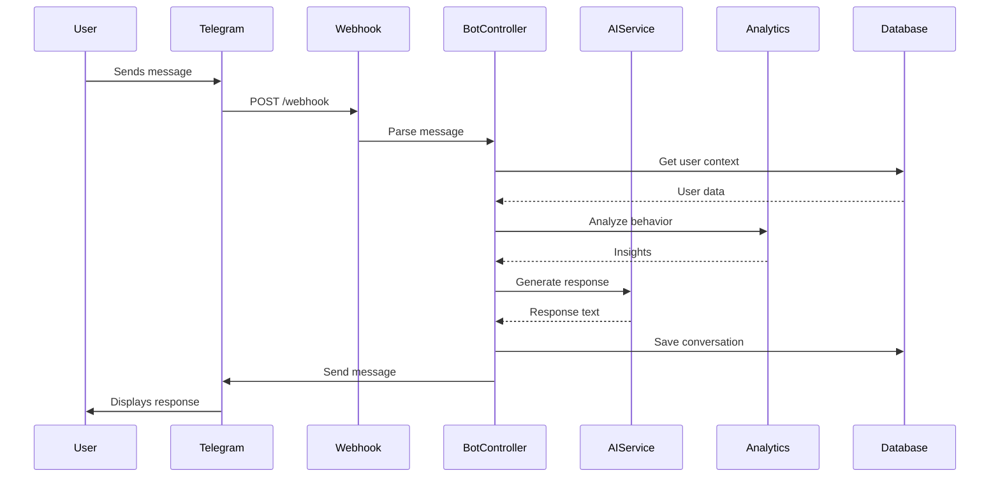

# Design Document: Intelligent Telegram Bot for VibeStudy

## Overview

This document outlines the technical design for transforming the VibeStudy Telegram bot into an intelligent learning companion. The enhanced bot will leverage AI, behavioral analytics, and smart scheduling to provide personalized support throughout the 90-day learning journey. The design focuses on scalability, reliability, and user experience while maintaining simplicity in implementation.

## Architecture

### High-Level Architecture

```
┌─────────────────────────────────────────────────────────────┐
│                     Telegram Bot API                         │
└────────────────────┬────────────────────────────────────────┘
                     │
                     ▼
┌─────────────────────────────────────────────────────────────┐
│                  Webhook Handler (Next.js API)               │
│  /api/telegram/webhook - Receives messages                  │
│  /api/telegram/send - Sends messages                        │
└────────────────────┬────────────────────────────────────────┘
                     │
                     ▼
┌─────────────────────────────────────────────────────────────┐
│                    Bot Controller Layer                      │
│  - Command Router                                           │
│  - Message Parser                                           │
│  - Context Manager                                          │
└────────────────────┬────────────────────────────────────────┘
                     │
        ┌────────────┼────────────┐
        ▼            ▼            ▼
┌──────────┐  ┌──────────┐  ┌──────────┐
│ AI       │  │ Analytics│  │ Scheduler│
│ Service  │  │ Engine   │  │ Service  │
└────┬─────┘  └────┬─────┘  └────┬─────┘
     │             │             │
     └─────────────┼─────────────┘
                   ▼
┌─────────────────────────────────────────────────────────────┐
│                    Data Layer (Supabase)                     │
│  - user_telegram_profiles                                   │
│  - telegram_messages                                        │
│  - reminder_schedules                                       │
│  - learning_analytics                                       │
│  - bot_conversations                                        │
└─────────────────────────────────────────────────────────────┘
```

### Component Interaction Flow



## Components and Interfaces

### 1. Bot Controller (`src/telegram/bot-controller.ts`)

**Purpose:** Central orchestrator for all bot interactions

**Interface:**
```typescript
interface BotController {
  handleMessage(update: TelegramUpdate): Promise<void>;
  handleCommand(command: string, userId: string, args: string[]): Promise<BotResponse>;
  handleCallback(callbackQuery: CallbackQuery): Promise<void>;
  handleVoiceMessage(voiceMessage: VoiceMessage): Promise<void>;
}

interface BotResponse {
  text: string;
  parseMode?: 'Markdown' | 'HTML';
  replyMarkup?: InlineKeyboard | ReplyKeyboard;
  disableNotification?: boolean;
}
```

**Key Methods:**
- `handleMessage()` - Routes incoming messages to appropriate handlers
- `handleCommand()` - Processes bot commands (/start, /stats, etc.)
- `handleCallback()` - Handles inline button clicks
- `handleVoiceMessage()` - Transcribes and processes voice messages

### 2. AI Service (`src/telegram/ai-service.ts`)

**Purpose:** Generates intelligent responses using Hugging Face API

**Interface:**
```typescript
interface AIService {
  generateRecommendation(userContext: UserContext): Promise<string>;
  generateMotivation(userProgress: UserProgress): Promise<string>;
  answerQuestion(question: string, lessonContext: LessonContext): Promise<string>;
  generateHint(taskId: string, userCode: string, level: HintLevel): Promise<string>;
  analyzeWeakTopics(userHistory: TaskAttempt[]): Promise<WeakTopic[]>;
}

interface UserContext {
  userId: string;
  currentDay: number;
  completedDays: number;
  streak: number;
  weakTopics: string[];
  learningVelocity: number;
  lastActiveTime: Date;
}

type HintLevel = 'subtle' | 'moderate' | 'detailed';
```

**Implementation Details:**
- Uses Hugging Face Router API with MiniMax model
- Caches common responses in Redis for performance
- Implements rate limiting (10 AI requests per user per day)
- Falls back to template responses if API fails

### 3. Analytics Engine (`src/telegram/analytics-engine.ts`)

**Purpose:** Analyzes user behavior and generates insights

**Interface:**
```typescript
interface AnalyticsEngine {
  analyzeLearningPattern(userId: string): Promise<LearningPattern>;
  predictCompletionDate(userId: string): Promise<PredictionResult>;
  identifyOptimalStudyTime(userId: string): Promise<TimeSlot[]>;
  calculateEngagementScore(userId: string): Promise<number>;
  detectRiskFactors(userId: string): Promise<RiskFactor[]>;
}

interface LearningPattern {
  preferredStudyTimes: TimeSlot[];
  averageSessionDuration: number;
  studyFrequency: number; // days per week
  focusTopics: string[];
  weakTopics: string[];
  learningVelocity: number; // days completed per week
}

interface PredictionResult {
  estimatedCompletionDate: Date;
  confidenceScore: number; // 0-100
  riskFactors: RiskFactor[];
  recommendations: string[];
}

interface RiskFactor {
  type: 'low_velocity' | 'weak_topic' | 'declining_engagement' | 'long_absence';
  severity: 'low' | 'medium' | 'high';
  description: string;
  suggestion: string;
}
```

**Algorithms:**
- **Learning Pattern Detection:** Analyzes last 30 days of activity
- **Completion Prediction:** Linear regression on velocity + risk adjustment
- **Optimal Time Detection:** Clusters study sessions by hour, finds peak performance
- **Engagement Score:** Weighted formula: `(streak * 0.3) + (velocity * 0.4) + (task_completion_rate * 0.3)`

### 4. Scheduler Service (`src/telegram/scheduler-service.ts`)

**Purpose:** Manages reminder scheduling and delivery

**Interface:**
```typescript
interface SchedulerService {
  scheduleReminder(userId: string, config: ReminderConfig): Promise<void>;
  cancelReminder(userId: string, reminderId: string): Promise<void>;
  updateReminderFrequency(userId: string, frequency: ReminderFrequency): Promise<void>;
  processScheduledReminders(): Promise<ProcessResult>;
  adaptReminderTiming(userId: string): Promise<void>;
}

interface ReminderConfig {
  type: 'daily_study' | 'streak_protection' | 'milestone' | 'custom';
  time: string; // HH:MM format
  timezone: string;
  enabled: boolean;
  adaptiveMode: boolean; // Adjust based on user behavior
}

interface ReminderFrequency {
  dailyReminders: boolean;
  streakProtection: boolean;
  weeklyReports: boolean;
  milestoneAlerts: boolean;
}
```

**Scheduling Logic:**
- Uses Vercel Cron Jobs for hourly checks
- Stores schedules in `reminder_schedules` table
- Implements adaptive timing based on user response patterns
- Reduces frequency if user ignores 3+ consecutive reminders

### 5. Message Builder (`src/telegram/message-builder.ts`)

**Purpose:** Constructs formatted messages with inline keyboards

**Interface:**
```typescript
interface MessageBuilder {
  buildStatsMessage(stats: UserStats): BotMessage;
  buildProgressMessage(progress: UserProgress): BotMessage;
  buildReminderMessage(context: ReminderContext): BotMessage;
  buildMotivationMessage(motivation: string): BotMessage;
  buildHelpMessage(): BotMessage;
  buildQuickActionsKeyboard(): InlineKeyboard;
}

interface BotMessage {
  text: string;
  parseMode: 'Markdown' | 'HTML';
  replyMarkup?: InlineKeyboard;
  disableWebPagePreview?: boolean;
}

interface InlineKeyboard {
  inline_keyboard: InlineButton[][];
}

interface InlineButton {
  text: string;
  callback_data?: string;
  url?: string;
}
```

**Message Templates:**
- Progress bars using Unicode blocks: `████████░░`
- Emoji indicators for status: 🎯 ✅ 🔥 ⭐ 💻
- Markdown formatting for emphasis
- Inline buttons for quick actions

### 6. Voice Handler (`src/telegram/voice-handler.ts`)

**Purpose:** Processes voice messages and generates voice responses

**Interface:**
```typescript
interface VoiceHandler {
  transcribeVoice(fileId: string): Promise<string>;
  generateVoiceResponse(text: string, language: 'ru' | 'en'): Promise<Buffer>;
  detectLanguage(audioBuffer: Buffer): Promise<'ru' | 'en'>;
}
```

**Implementation:**
- Uses Telegram's `getFile` API to download voice message
- Transcribes using Web Speech API or external service
- Generates voice responses using TTS service (optional feature)
- Caches transcriptions for 24 hours

## Data Models

### Database Schema

#### `user_telegram_profiles`
```sql
CREATE TABLE user_telegram_profiles (
  id UUID PRIMARY KEY DEFAULT uuid_generate_v4(),
  user_id UUID REFERENCES auth.users(id) ON DELETE CASCADE,
  telegram_user_id BIGINT UNIQUE NOT NULL,
  chat_id BIGINT NOT NULL,
  username TEXT,
  first_name TEXT,
  language_code TEXT DEFAULT 'ru',
  timezone TEXT DEFAULT 'Europe/Moscow',
  is_active BOOLEAN DEFAULT true,
  created_at TIMESTAMPTZ DEFAULT NOW(),
  updated_at TIMESTAMPTZ DEFAULT NOW()
);

CREATE INDEX idx_telegram_user_id ON user_telegram_profiles(telegram_user_id);
CREATE INDEX idx_user_id ON user_telegram_profiles(user_id);
```

#### `reminder_schedules`
```sql
CREATE TABLE reminder_schedules (
  id UUID PRIMARY KEY DEFAULT uuid_generate_v4(),
  user_id UUID REFERENCES auth.users(id) ON DELETE CASCADE,
  reminder_type TEXT NOT NULL, -- 'daily_study', 'streak_protection', etc.
  scheduled_time TIME NOT NULL,
  timezone TEXT NOT NULL,
  enabled BOOLEAN DEFAULT true,
  adaptive_mode BOOLEAN DEFAULT true,
  last_sent_at TIMESTAMPTZ,
  ignore_count INTEGER DEFAULT 0,
  created_at TIMESTAMPTZ DEFAULT NOW(),
  updated_at TIMESTAMPTZ DEFAULT NOW()
);

CREATE INDEX idx_reminder_user ON reminder_schedules(user_id);
CREATE INDEX idx_reminder_time ON reminder_schedules(scheduled_time) WHERE enabled = true;
```

#### `telegram_messages`
```sql
CREATE TABLE telegram_messages (
  id UUID PRIMARY KEY DEFAULT uuid_generate_v4(),
  user_id UUID REFERENCES auth.users(id) ON DELETE CASCADE,
  message_type TEXT NOT NULL, -- 'user_message', 'bot_response', 'reminder', etc.
  content TEXT NOT NULL,
  metadata JSONB, -- Additional data like buttons clicked, voice transcription, etc.
  created_at TIMESTAMPTZ DEFAULT NOW()
);

CREATE INDEX idx_messages_user ON telegram_messages(user_id);
CREATE INDEX idx_messages_created ON telegram_messages(created_at DESC);
```

#### `learning_analytics`
```sql
CREATE TABLE learning_analytics (
  id UUID PRIMARY KEY DEFAULT uuid_generate_v4(),
  user_id UUID REFERENCES auth.users(id) ON DELETE CASCADE,
  date DATE NOT NULL,
  study_duration_minutes INTEGER DEFAULT 0,
  tasks_completed INTEGER DEFAULT 0,
  tasks_attempted INTEGER DEFAULT 0,
  session_count INTEGER DEFAULT 0,
  engagement_score DECIMAL(5,2),
  weak_topics JSONB,
  created_at TIMESTAMPTZ DEFAULT NOW(),
  UNIQUE(user_id, date)
);

CREATE INDEX idx_analytics_user_date ON learning_analytics(user_id, date DESC);
```

#### `bot_conversations`
```sql
CREATE TABLE bot_conversations (
  id UUID PRIMARY KEY DEFAULT uuid_generate_v4(),
  user_id UUID REFERENCES auth.users(id) ON DELETE CASCADE,
  conversation_context JSONB, -- Stores conversation state
  last_command TEXT,
  last_interaction_at TIMESTAMPTZ DEFAULT NOW(),
  created_at TIMESTAMPTZ DEFAULT NOW()
);

CREATE INDEX idx_conversations_user ON bot_conversations(user_id);
```

## API Endpoints

### Webhook Endpoints

#### `POST /api/telegram/webhook`
Receives updates from Telegram Bot API

**Request Body:**
```typescript
interface TelegramUpdate {
  update_id: number;
  message?: Message;
  callback_query?: CallbackQuery;
  edited_message?: Message;
}
```

**Response:**
```typescript
{ ok: true }
```

#### `POST /api/telegram/send`
Sends messages to users (internal use)

**Request Body:**
```typescript
interface SendMessageRequest {
  chatId: number;
  text: string;
  parseMode?: 'Markdown' | 'HTML';
  replyMarkup?: InlineKeyboard;
}
```

### Cron Endpoints

#### `POST /api/telegram/cron/reminders`
Processes scheduled reminders (runs hourly)

**Authentication:** Requires `CRON_SECRET` header

**Response:**
```typescript
interface ReminderProcessResult {
  success: boolean;
  processed: number;
  sent: number;
  failed: number;
  errors: string[];
}
```

#### `POST /api/telegram/cron/daily-digest`
Sends daily digest to users (runs at configured times)

**Authentication:** Requires `CRON_SECRET` header

#### `POST /api/telegram/cron/weekly-report`
Sends weekly reports (runs every Sunday)

**Authentication:** Requires `CRON_SECRET` header

## Command Handlers

### Core Commands

#### `/start`
**Purpose:** Initialize bot interaction

**Response:**
- Welcome message with user's name
- Quick overview of bot capabilities
- Inline keyboard with quick actions: "Today's Lesson", "My Progress", "Settings"

#### `/help`
**Purpose:** Display available commands

**Response:**
- List of all commands with descriptions
- Link to documentation
- Support contact information

#### `/stats`
**Purpose:** Show current progress statistics

**Response:**
```
📊 *Твоя статистика VibeStudy*

🎯 Текущий день: 30/90
✅ Завершено: 25 дней (28%)
████████░░

🔥 Серия: 7 дней
⭐ Средний балл: 78/100
💻 Язык: PYTHON
⏱️ Время обучения: 15ч 30м

Продолжай в том же духе! 🚀
```

#### `/progress`
**Purpose:** Detailed progress analysis

**Response:**
- Weekly velocity chart
- Completion prediction
- Comparison with average learner
- Inline button: "View Full Report"

#### `/topics`
**Purpose:** Show mastery levels for all topics

**Response:**
```
📚 *Твоё мастерство по темам*

✅ Переменные: 95% ████████████
✅ Циклы: 88% ███████████░
⚠️ Функции: 65% ████████░░░░
❌ ООП: 45% ██████░░░░░░

💡 Рекомендую повторить: Функции, ООП
```

#### `/advice`
**Purpose:** Get personalized recommendation

**Response:**
- AI-generated advice based on current progress
- Specific suggestions for weak topics
- Study tips tailored to learning pattern

#### `/challenge`
**Purpose:** Get daily coding challenge

**Response:**
- Challenge description
- Difficulty level
- Time limit
- Inline button: "Start Challenge"

#### `/remind`
**Purpose:** Configure reminder settings

**Response:**
- Current reminder schedule
- Inline keyboard to adjust times
- Toggle for different reminder types

#### `/plan`
**Purpose:** Get personalized study plan

**Response:**
- Suggested weekly schedule
- Required daily effort to meet goals
- Catch-up strategies if behind

#### `/predict`
**Purpose:** Predict course completion

**Response:**
```
🔮 *Прогноз завершения курса*

📅 Ожидаемая дата: 15 марта 2025
📊 Уверенность: 78%

⚠️ *Факторы риска:*
• Снижение скорости обучения
• Слабое владение темой "Функции"

💡 *Рекомендации:*
• Увеличь время занятий на 15 минут в день
• Повтори дни 20-25
```

#### `/community`
**Purpose:** Access community features

**Response:**
- Active study groups
- Top learners this week
- Recent discussions
- Inline buttons: "Join Group", "View Leaderboard"

#### `/language`
**Purpose:** Change bot language

**Response:**
- Inline keyboard with language options: 🇷🇺 Русский, 🇬🇧 English

#### `/settings`
**Purpose:** Configure bot preferences

**Response:**
- Reminder settings
- Language preference
- Notification preferences
- Privacy settings
- Inline keyboard for each setting

#### `/privacy`
**Purpose:** View privacy policy and data controls

**Response:**
- Data collection explanation
- Inline buttons: "Export Data", "Delete Data", "Opt Out"

### Advanced Commands

#### `/hint [task_id]`
**Purpose:** Get progressive hint for current task

**Response:**
- Hint level indicator (1/3, 2/3, 3/3)
- Hint text
- Cooldown timer for next hint
- Inline button: "Got it" or "Need more help"

#### `/ask [question]`
**Purpose:** Ask AI mentor a question

**Response:**
- AI-generated answer
- Related code examples
- Links to relevant lessons
- Daily question counter (X/10 remaining)

#### `/schedule [time]`
**Purpose:** Schedule a study session

**Response:**
- Confirmation of scheduled session
- Reminder will be sent 10 minutes before
- Inline button: "Cancel Session"

#### `/export`
**Purpose:** Export all user data

**Response:**
- Generates JSON file with all data
- Sends as document attachment
- Includes: progress, achievements, messages, analytics

## Error Handling

### Error Types and Responses

#### Network Errors
```typescript
if (error.code === 'ECONNREFUSED') {
  await sendMessage(chatId, '⚠️ Временные проблемы с подключением. Попробуй через минуту.');
}
```

#### Rate Limit Errors
```typescript
if (error.code === 429) {
  await sendMessage(chatId, '⏳ Слишком много запросов. Подожди немного.');
}
```

#### AI Service Errors
```typescript
if (aiServiceError) {
  // Fallback to template response
  const templateResponse = getTemplateResponse(command);
  await sendMessage(chatId, templateResponse);
}
```

#### Database Errors
```typescript
if (dbError) {
  logger.error('Database error:', dbError);
  await sendMessage(chatId, '❌ Произошла ошибка. Мы уже работаем над исправлением.');
}
```

### Retry Logic

```typescript
async function sendMessageWithRetry(chatId: number, text: string, maxRetries = 3) {
  for (let attempt = 1; attempt <= maxRetries; attempt++) {
    try {
      return await sendMessage(chatId, text);
    } catch (error) {
      if (attempt === maxRetries) throw error;
      await sleep(1000 * attempt); // Exponential backoff
    }
  }
}
```

## Testing Strategy

### Unit Tests

**Test Coverage:**
- Command handlers (all commands)
- Message builders (formatting, keyboards)
- Analytics engine (calculations, predictions)
- AI service (response generation, fallbacks)

**Example Test:**
```typescript
describe('BotController', () => {
  it('should handle /stats command', async () => {
    const response = await botController.handleCommand('/stats', 'user123', []);
    expect(response.text).toContain('Твоя статистика');
    expect(response.parseMode).toBe('Markdown');
  });
});
```

### Integration Tests

**Test Scenarios:**
- Webhook receives message → Bot responds
- Scheduled reminder → Message sent
- User clicks inline button → Callback handled
- Voice message → Transcribed and processed

### End-to-End Tests

**Test Flow:**
1. User sends `/start` → Bot responds with welcome
2. User sends `/stats` → Bot shows statistics
3. User clicks "Today's Lesson" → Bot provides lesson link
4. User sends question → AI responds
5. User completes task → Bot sends congratulations

## Performance Optimization

### Caching Strategy

```typescript
// Cache frequently accessed data
const cache = new Map<string, CacheEntry>();

interface CacheEntry {
  data: any;
  expiresAt: number;
}

function getCached<T>(key: string): T | null {
  const entry = cache.get(key);
  if (!entry || entry.expiresAt < Date.now()) {
    cache.delete(key);
    return null;
  }
  return entry.data;
}

function setCache(key: string, data: any, ttlSeconds: number) {
  cache.set(key, {
    data,
    expiresAt: Date.now() + ttlSeconds * 1000
  });
}
```

**Cached Data:**
- User stats (TTL: 5 minutes)
- AI responses for common questions (TTL: 1 hour)
- Learning analytics (TTL: 10 minutes)
- Template messages (TTL: 24 hours)

### Database Query Optimization

```sql
-- Index for fast user lookup
CREATE INDEX idx_telegram_user_id ON user_telegram_profiles(telegram_user_id);

-- Index for reminder processing
CREATE INDEX idx_reminder_time ON reminder_schedules(scheduled_time) 
WHERE enabled = true;

-- Materialized view for analytics
CREATE MATERIALIZED VIEW user_analytics_summary AS
SELECT 
  user_id,
  COUNT(*) as total_days,
  AVG(engagement_score) as avg_engagement,
  SUM(study_duration_minutes) as total_study_time
FROM learning_analytics
GROUP BY user_id;

-- Refresh hourly
REFRESH MATERIALIZED VIEW CONCURRENTLY user_analytics_summary;
```

### Rate Limiting

```typescript
const rateLimiter = new Map<string, RateLimitEntry>();

interface RateLimitEntry {
  count: number;
  resetAt: number;
}

function checkRateLimit(userId: string, limit: number, windowSeconds: number): boolean {
  const now = Date.now();
  const entry = rateLimiter.get(userId);
  
  if (!entry || entry.resetAt < now) {
    rateLimiter.set(userId, {
      count: 1,
      resetAt: now + windowSeconds * 1000
    });
    return true;
  }
  
  if (entry.count >= limit) {
    return false;
  }
  
  entry.count++;
  return true;
}
```

**Rate Limits:**
- Commands: 30 per minute per user
- AI questions: 10 per day per user
- Voice messages: 20 per hour per user

## Security Considerations

### Webhook Verification

```typescript
function verifyTelegramWebhook(req: Request): boolean {
  const token = req.headers.get('X-Telegram-Bot-Api-Secret-Token');
  return token === process.env.TELEGRAM_WEBHOOK_SECRET;
}
```

### Data Encryption

```typescript
// Encrypt sensitive data before storing
function encryptData(data: string): string {
  const cipher = crypto.createCipher('aes-256-cbc', process.env.ENCRYPTION_KEY);
  return cipher.update(data, 'utf8', 'hex') + cipher.final('hex');
}

function decryptData(encrypted: string): string {
  const decipher = crypto.createDecipher('aes-256-cbc', process.env.ENCRYPTION_KEY);
  return decipher.update(encrypted, 'hex', 'utf8') + decipher.final('utf8');
}
```

### Input Validation

```typescript
function sanitizeInput(text: string): string {
  // Remove potentially harmful characters
  return text
    .replace(/<script>/gi, '')
    .replace(/javascript:/gi, '')
    .trim()
    .slice(0, 4096); // Telegram message limit
}
```

## Monitoring and Logging

### Logging Strategy

```typescript
interface LogEntry {
  timestamp: Date;
  level: 'info' | 'warn' | 'error';
  userId?: string;
  action: string;
  details: any;
  duration?: number;
}

function log(entry: LogEntry) {
  console.log(JSON.stringify({
    ...entry,
    timestamp: entry.timestamp.toISOString()
  }));
  
  // Also send to monitoring service
  if (entry.level === 'error') {
    sendToErrorTracking(entry);
  }
}
```

### Metrics to Track

- **Performance:**
  - Response time (p50, p95, p99)
  - API call duration
  - Database query time

- **Usage:**
  - Active users (daily, weekly, monthly)
  - Commands used (frequency distribution)
  - AI questions asked
  - Reminders sent vs ignored

- **Reliability:**
  - Error rate
  - Webhook delivery success rate
  - Cron job execution success rate

### Health Checks

```typescript
// GET /api/telegram/health
export async function GET() {
  const checks = {
    database: await checkDatabase(),
    telegram: await checkTelegramAPI(),
    ai: await checkAIService(),
    timestamp: new Date().toISOString()
  };
  
  const healthy = Object.values(checks).every(c => c === true);
  
  return Response.json(checks, {
    status: healthy ? 200 : 503
  });
}
```

## Deployment

### Environment Variables

```env
# Telegram
TELEGRAM_BOT_TOKEN=your_bot_token
TELEGRAM_WEBHOOK_SECRET=random_secret_for_webhook_verification
CRON_SECRET=random_secret_for_cron_endpoints

# Supabase
NEXT_PUBLIC_SUPABASE_URL=your_supabase_url
NEXT_PUBLIC_SUPABASE_ANON_KEY=your_anon_key
SUPABASE_SERVICE_ROLE_KEY=your_service_role_key

# AI Service
HF_TOKEN=your_huggingface_token
HF_API_BASE_URL=https://router.huggingface.co/v1
HF_MODEL=MiniMaxAI/MiniMax-M2:novita

# Encryption
ENCRYPTION_KEY=random_32_byte_key

# Monitoring (optional)
SENTRY_DSN=your_sentry_dsn
```

### Vercel Configuration

```json
{
  "crons": [
    {
      "path": "/api/telegram/cron/reminders",
      "schedule": "0 * * * *"
    },
    {
      "path": "/api/telegram/cron/daily-digest",
      "schedule": "0 9,14,19,22 * * *"
    },
    {
      "path": "/api/telegram/cron/weekly-report",
      "schedule": "0 10 * * 0"
    }
  ]
}
```

### Webhook Setup

```bash
# Set webhook after deployment
curl -X POST "https://api.telegram.org/bot${TELEGRAM_BOT_TOKEN}/setWebhook" \
  -H "Content-Type: application/json" \
  -d "{
    \"url\": \"https://your-domain.com/api/telegram/webhook\",
    \"secret_token\": \"${TELEGRAM_WEBHOOK_SECRET}\"
  }"
```

## Future Enhancements

### Phase 2 Features

1. **Group Chat Support**
   - Bot works in study group chats
   - Facilitates group challenges
   - Tracks group progress

2. **Voice Responses**
   - Bot can respond with voice messages
   - Text-to-speech for explanations
   - Pronunciation help for programming terms

3. **Rich Media**
   - Send code visualization GIFs
   - Interactive diagrams
   - Video tutorials

4. **Advanced AI**
   - Code review via bot
   - Debugging assistance
   - Project idea generation

5. **Integrations**
   - GitHub integration for project tracking
   - Calendar integration for scheduling
   - Notion/Obsidian for note syncing

### Scalability Considerations

- **Message Queue:** Implement Redis queue for high-volume message processing
- **Load Balancing:** Distribute webhook processing across multiple instances
- **Database Sharding:** Partition user data by region for global scale
- **CDN:** Cache static responses and media files

---

**Design Version:** 1.0  
**Last Updated:** November 14, 2025  
**Status:** Ready for Implementation
