<div align="center">

# 🎯 VibeStudy

### От нуля до junior за 90 дней

*Интерактивная платформа для изучения программирования с AI-ассистентом, геймификацией и персональным подходом*

[](https://nextjs.org/)
[](https://www.typescriptlang.org/)
[](https://supabase.com/)
[](https://huggingface.co/)

[🚀 Быстрый старт](#-быстрый-старт) • [✨ Возможности](#-что-внутри) • [📖 Документация](#-документация) • [🤝 Контрибьюция](#-вклад-в-проект)

</div>

---

## 🎬 Почему VibeStudy?

> **"Учиться программированию должно быть интересно, а не мучительно"**

Мы создали платформу, которая объединяет структурированное обучение, искусственный интеллект и геймификацию, чтобы сделать путь в программирование максимально эффективным и увлекательным.

### 🎯 Для кого это?

- 🌱 **Новичков** — начните с нуля, без предварительных знаний
- 🔄 **Переквалификантов** — структурированный путь в новую профессию
- 🎓 **Студентов** — дополнение к академическому образованию
- 💼 **Самоучек** — систематизация знаний и заполнение пробелов

---

## ✨ Что внутри?

### 🧠 AI-Ассистент нового поколения

Не просто генератор задач — ваш персональный наставник:

```
🤖 Умный помощник:
├─ Генерирует уникальные задачи под ваш уровень
├─ Проверяет код и объясняет ошибки
├─ Дает подсказки, не раскрывая решение
├─ Адаптирует сложность на основе прогресса
└─ Отвечает на вопросы по теории
```

**Технологии:** GPT Lama API, GPT-4o-mini, адаптивные алгоритмы

### 📚 7 языков программирования

Выберите свой путь или изучите несколько:

| Язык | Уровень | Применение |
|------|---------|------------|
| 🐍 **Python** | Beginner-friendly | Data Science, Backend, Automation |
| 🟨 **JavaScript** | Web-стандарт | Frontend, Full-stack, Node.js |
| 🔷 **TypeScript** | JS + типы | Enterprise, React, Angular |
| ☕ **Java** | Enterprise | Android, Backend, Big Data |
| ⚡ **C++** | Performance | GameDev, Systems, Embedded |
| 🎯 **C#** | Microsoft | Unity, .NET, Desktop |
| 🐹 **Go** | Modern | Cloud, Microservices, DevOps |

### ⚔️ Ежедневные Челленджи (Challenges)

Прокачивайте навыки каждый день с новыми задачами:

- **📅 Ежедневные задачи:** Уникальная задача каждый день для выбранного языка.
- **🏆 История решений:** Отслеживайте свой прогресс и возвращайтесь к прошлым задачам.
- **⚡ Уровни сложности:** Easy, Medium, Hard - задачи под любой уровень подготовки.
- **⏱️ Тайминг:** Оценка времени на решение для планирования занятий.

### 💎 Тарифные планы (Pricing)

Гибкая система подписки для доступа к расширенным возможностям:

- **Starter (Free):** Базовый доступ, 5 AI-запросов в день.
- **Premium:** Безлимитный AI (GPT-4o), приоритетная генерация.
- **Pro+:** Максимальная мощность (Claude 3.5 Sonnet), мгновенная генерация, персональный ментор.
- **💳 Оплата TON:** Современная и быстрая оплата криптовалютой TON.

### 🎮 Геймификация, которая работает

**21 достижение** в 4 категориях:

- 🏆 **Прогресс** — Первые шаги, Марафонец, Финишная прямая
- 🔥 **Серии** — Неделя силы, Месяц упорства, Несгибаемый
- 💪 **Мастерство** — Решатель, Перфекционист, Код-ниндзя
- 🌟 **Особые** — Ночной кодер, Спринтер, Исследователь

**Система мотивации:**
- Визуальные прогресс-бары
- Анимированные уведомления
- Календарь активности (GitHub-style)
- Статистика по неделям и месяцам

### 🔐 Гибкая аутентификация

**Начните сразу или синхронизируйте позже:**

```
👤 Гостевой режим
   └─ Все функции доступны
   └─ Прогресс в браузере
   └─ Без регистрации

🔑 Полный доступ
   ├─ Google OAuth (1 клик)
   ├─ Magic Link (email)
   └─ Синхронизация между устройствами
```

### 📱 Telegram-бот

Ваш карманный тренер:

- ⏰ Напоминания о занятиях
- 📊 Ежедневная статистика
- 💡 Мотивационные сообщения
- 🎯 Персональные рекомендации

### 🎨 Monaco Editor

Профессиональный редактор кода (как в VS Code):

- Подсветка синтаксиса для всех языков
- Автодополнение
- Проверка ошибок в реальном времени
- Темная тема
- Горячие клавиши

### 📊 Детальная аналитика

Отслеживайте свой рост:

- 📈 Графики прогресса по неделям
- 🗓️ Календарь активности (90 дней)
- 🎯 Распределение задач по сложности
- 🧠 Профиль знаний по темам
- ⏱️ Время на решение задач

### 🌐 Мультиязычность

- 🇷🇺 Русский (по умолчанию)
- 🇬🇧 English
- Легко добавить новые языки через i18n

---

## 🚀 Быстрый старт

### Вариант 1: Минимальная настройка (5 минут)

**Для тех, кто хочет попробовать прямо сейчас:**

```bash
# 1. Клонируйте репозиторий
git clone https://github.com/yourusername/vibestudy.git
cd vibestudy

# 2. Установите зависимости
npm install

# 3. Создайте минимальный .env.local
echo "HF_TOKEN=your_gptlama_token" > .env.local
echo "HF_API_BASE_URL=https://api.gptlama.ru/v1" >> .env.local
echo "HF_MODEL=gpt-4o-mini" >> .env.local

# 4. Запустите!
npm run dev
```

🎉 Откройте [http://localhost:3000](http://localhost:3000) и начинайте учиться!

> **Совет:** Получите токен на [gptlama.ru](https://gptlama.ru/)

### Вариант 2: Полная настройка (15 минут)

**Для максимального опыта с облачной синхронизацией:**

<details>
<summary>📋 Развернуть инструкцию</summary>

```bash
# 1. Клонируйте и установите
git clone https://github.com/yourusername/vibestudy.git
cd vibestudy
npm install

# 2. Создайте .env.local со всеми настройками
cat > .env.local << 'EOF'
# 🤖 AI (обязательно)
HF_TOKEN=your_gptlama_token
HF_API_BASE_URL=https://api.gptlama.ru/v1
HF_MODEL=gpt-4o-mini

# ☁️ Supabase (для синхронизации)
NEXT_PUBLIC_SUPABASE_URL=your_supabase_url
NEXT_PUBLIC_SUPABASE_ANON_KEY=your_supabase_anon_key
SUPABASE_SERVICE_ROLE_KEY=your_service_role_key

# 📱 Telegram (для уведомлений)
TELEGRAM_BOT_TOKEN=your_bot_token
CRON_SECRET=your_random_secret
EOF

# 3. Настройте Supabase (выполните SQL из supabase/schema.sql)

# 4. Запустите с ботом
npm run dev
```

</details>

### 🎮 Режимы запуска

```bash
npm run dev          # 🚀 Full: Next.js + Telegram бот
npm run dev:next     # 🌐 Только веб-сервер
npm run build        # 📦 Production build
npm run start        # ▶️  Production server
```

---

## ⚙️ Настройка интеграций

### 🤖 GPT Lama API (обязательно для AI)

<details>
<summary>Как получить токен?</summary>

1. Зарегистрируйтесь на [gptlama.ru](https://gptlama.ru/)
2. Получите API токен в личном кабинете
3. Добавьте в `.env.local`:
   ```bash
   HF_TOKEN=ваш_токен
   HF_API_BASE_URL=https://api.gptlama.ru/v1
   HF_MODEL=gpt-4o-mini
   ```

**Модель:** GPT-4o-mini для быстрых и качественных ответов

</details>

### ☁️ Supabase (опционально)

<details>
<summary>Настройка облачной синхронизации</summary>

1. Создайте проект на [supabase.com](https://supabase.com)
2. Скопируйте ключи из Settings → API
3. Выполните SQL из `supabase/schema.sql` в SQL Editor
4. Настройте Google OAuth в Authentication → Providers
5. Добавьте в `.env.local`:
   ```bash
   NEXT_PUBLIC_SUPABASE_URL=https://xxx.supabase.co
   NEXT_PUBLIC_SUPABASE_ANON_KEY=eyJxxx...
   SUPABASE_SERVICE_ROLE_KEY=eyJxxx...
   ```

📚 **Подробнее:** `SUPABASE_SETUP.md`, `SUPABASE_AUTH_SETUP.md`

</details>

### 📱 Telegram Bot (опционально)

<details>
<summary>Подключение уведомлений</summary>

1. Создайте бота через [@BotFather](https://t.me/BotFather)
2. Получите токен
3. Добавьте в `.env.local`:
   ```bash
   TELEGRAM_BOT_TOKEN=123456:ABC-DEF...
   CRON_SECRET=random_secret_string
   ```
4. Запустите `npm run bot:webhook` для настройки webhook

📚 **Подробнее:** `TELEGRAM_BOT_SETUP.md`

</details>

### 🚀 Гостевой режим

**Не хотите настраивать?** Просто запустите и используйте кнопку **"Продолжить без регистрации"**!

✅ Все функции работают  
✅ Прогресс в localStorage  
⚠️ Нет синхронизации между устройствами

---

## 📂 Архитектура проекта

```
VibeStudy/
├── 🎨 src/
│   ├── app/                      # Next.js 14 App Router
│   │   ├── page.tsx             # 🏠 Landing page
│   │   ├── learn/               # 📚 Главный интерфейс обучения
│   │   ├── profile/             # 👤 Профиль пользователя
│   │   ├── playground/          # 🎮 Песочница для кода
│   │   ├── challenges/          # ⚔️ Ежедневные задачи
│   │   ├── pricing/             # 💎 Тарифы и оплата
│   │   ├── analytics/           # 📊 Статистика и графики
│   │   └── api/                 # 🔌 API endpoints
│   │       ├── generate-tasks/  # AI генерация
│   │       ├── check-code/      # Проверка кода
│   │       ├── execute-code/    # Выполнение кода
│   │       ├── challenges/      # API задач
│   │       ├── ton/             # API оплаты TON
│   │       └── telegram/        # Telegram webhook
│   │
│   ├── components/              # ⚛️ React компоненты
│   │   ├── ui/                  # Базовые UI (shadcn/ui)
│   │   ├── dashboard/           # Дашборд обучения
│   │   ├── achievements/        # Система достижений
│   │   ├── statistics/          # Графики и аналитика
│   │   ├── profile/             # Компоненты профиля
│   │   ├── playground/          # Monaco Editor
│   │   ├── challenges/          # Компоненты задач
│   │   ├── pricing/             # Компоненты оплаты
│   │   └── landing/             # Landing page
│   │
│   ├── lib/                     # 🛠️ Бизнес-логика
│   │   ├── curriculum.ts        # 90-дневная программа
│   │   ├── achievements.ts      # Логика достижений
│   │   ├── ai-client.ts         # Hugging Face API
│   │   ├── languages.ts         # Конфиги языков
│   │   ├── i18n/                # Интернационализация
│   │   ├── supabase/            # Supabase queries
│   │   └── telegram/            # Telegram bot
│   │
│   ├── store/                   # 🗄️ Zustand State Management
│   │   ├── progress-store.ts    # Прогресс обучения
│   │   ├── achievements-store.ts # Достижения
│   │   ├── profile-store.ts     # Профиль
│   │   ├── locale-store.ts      # Язык интерфейса
│   │   └── analytics-store.ts   # Аналитика
│   │
│   └── types/                   # 📝 TypeScript типы
│
├── 🗄️ supabase/
│   ├── schema.sql               # Схема БД
│   └── migrations/              # Миграции
│
├── 🧪 tests/
│   ├── e2e/                     # Playwright E2E
│   └── unit/                    # Unit тесты
│
├── 📜 scripts/
│   ├── dev-with-bot.js          # Dev сервер + бот
│   ├── telegram-bot-local.js    # Локальный бот
│   └── validate-translations.ts # Проверка i18n
│
└── 📚 docs/
    ├── SUPABASE_SETUP.md
    ├── TELEGRAM_BOT_SETUP.md
    └── FEATURES.md
```

### 🏗️ Технологический стек

<table>
<tr>
<td width="50%">

**Frontend**
- ⚛️ React 18.3.1
- ⚡ Next.js 14.2.8 (App Router)
- 🔷 TypeScript 5.4.5
- 🎨 TailwindCSS 3.4.4
- ✨ Framer Motion 11.2.6
- 🎭 Radix UI

</td>
<td width="50%">

**Backend & Services**
- 🗄️ Supabase (PostgreSQL)
- 🤖 GPT Lama API (GPT-4o-mini)
- 📱 Telegram Bot API
- 💎 TON Blockchain (Payments)
- 🔐 Supabase Auth
- 💾 Zustand + localStorage

</td>
</tr>
<tr>
<td>

**Developer Tools**
- 📝 Monaco Editor 4.6.0
- 🧪 Playwright 1.56.1
- 🔍 ESLint + Prettier
- 🎯 TypeScript Strict Mode

</td>
<td>

**Deployment**
- ▲ Vercel (рекомендуется)
- 🐳 Docker (опционально)
- 🌐 Node.js 18+

</td>
</tr>
</table>

---

## 🎯 Как это работает?

### 📖 Ваш путь обучения

```mermaid
graph LR
    A[🎯 Выбор языка] --> B[📚 День 1]
    B --> C[🤖 AI генерирует контент]
    C --> D[📖 Изучение теории]
    D --> E[💻 Решение задач]
    E --> F[✅ Проверка кода]
    F --> G[🏆 Достижения]
    G --> H[📊 Статистика]
    H --> I[📚 День 2]
    I --> J[... 90 дней]
    J --> K[🎓 Junior Developer!]
```



### 🚀 Пошаговая инструкция

1. **Выберите язык программирования**
   - Python, JavaScript, TypeScript, Java, C++, C#, или Go
   - Можно изучать несколько параллельно

2. **Генерируйте контент с AI**
   - Нажмите "Сгенерировать теорию и задания"
   - AI создаст уникальный контент под ваш уровень
   - Теория + 5 задач + контрольное задание

3. **Изучайте и практикуйтесь**
   - Читайте теорию
   - Решайте задачи в Monaco Editor
   - Получайте подсказки от AI при затруднениях

4. **Отслеживайте прогресс**
   - Зарабатывайте достижения
   - Поддерживайте серии
   - Анализируйте статистику

5. **Экспериментируйте в Playground**
   - Тестируйте идеи
   - Пробуйте новые концепции
   - Практикуйтесь без ограничений

### 💡 Полезные фичи

<table>
<tr>
<td width="50%">

**🤖 AI-Помощник**
- Проверка кода с объяснениями
- Подсказки без спойлеров
- Ответы на вопросы по теории
- Адаптивная сложность

</td>
<td width="50%">

**📊 Аналитика**
- Календарь активности
- Графики прогресса
- Время на задачи
- Профиль знаний

</td>
</tr>
<tr>
<td>

**🏆 Мотивация**
- 21 достижение
- Система серий
- Прогресс-бары
- Telegram-уведомления

</td>
<td>

**☁️ Синхронизация**
- Между устройствами
- История попыток
- Облачное хранение
- Offline-режим

</td>
</tr>
</table>

---

## 📝 Доступные команды

### 🚀 Разработка

```bash
npm run dev              # Next.js + Telegram бот
npm run dev:next         # Только Next.js (без бота)
npm run bot              # Только Telegram бот
npm run bot:test         # Тест бота
```

### 📦 Production

```bash
npm run build            # Сборка для продакшена
npm run start            # Запуск production сервера
```

### 🧪 Тестирование

```bash
npm run test:e2e         # Playwright E2E тесты
npm run test:e2e:ui      # Playwright UI mode
npm run test:e2e:headed  # С открытым браузером
npm run test:e2e:debug   # Debug mode
```

### 🔧 Утилиты

```bash
npm run lint             # ESLint проверка
npm run format           # Prettier форматирование
npm run bot:webhook      # Настройка Telegram webhook
npm run health-check     # Проверка здоровья сервиса
```

---

## 📖 Документация

Подробные гайды по настройке и использованию:

- 📘 [**FEATURES.md**](FEATURES.md) — Полное описание всех возможностей
- 🔐 [**AUTH_QUICK_START.md**](AUTH_QUICK_START.md) — Быстрая настройка аутентификации
- ☁️ [**SUPABASE_SETUP.md**](SUPABASE_SETUP.md) — Настройка Supabase
- 📱 [**TELEGRAM_BOT_SETUP.md**](TELEGRAM_BOT_SETUP.md) — Настройка Telegram бота
- 🚀 [**DEPLOY_INSTRUCTIONS.md**](DEPLOY_INSTRUCTIONS.md) — Деплой на Vercel
- 🧪 [**tests/README.md**](tests/README.md) — Тестирование

---

## 🤝 Вклад в проект

Мы рады любому вкладу! Вот как вы можете помочь:

### 🐛 Нашли баг?

1. Проверьте [Issues](https://github.com/yourusername/vibestudy/issues)
2. Создайте новый Issue с описанием проблемы
3. Или сразу создайте Pull Request с фиксом

### 💡 Есть идея?

1. Откройте [Discussion](https://github.com/yourusername/vibestudy/discussions)
2. Опишите вашу идею
3. Получите фидбек от сообщества

### 🔧 Хотите контрибьютить?

```bash
# 1. Fork репозитория
# 2. Клонируйте ваш fork
git clone https://github.com/your-username/vibestudy.git

# 3. Создайте ветку для фичи
git checkout -b feature/amazing-feature

# 4. Внесите изменения и закоммитьте
git commit -m "Add amazing feature"

# 5. Запушьте в ваш fork
git push origin feature/amazing-feature

# 6. Создайте Pull Request
```

### 📋 Что можно улучшить?

- 🌍 Добавить новые языки интерфейса
- 📚 Расширить учебную программу
- 🎨 Улучшить UI/UX
- 🧪 Написать больше тестов
- 📝 Улучшить документацию
- 🐛 Исправить баги

---

## 🌟 Roadmap

### В разработке

- [ ] 🎥 Видео-уроки для каждого дня
- [ ] 🤝 Система менторства
- [ ] 💬 Чат для студентов
- [ ] 🏅 Сертификаты о прохождении
- [ ] 📱 Мобильное приложение

### Планируется

- [ ] 🎯 Специализированные треки (Web, Mobile, Data Science)
- [ ] 🔄 Интеграция с GitHub для портфолио
- [ ] 🎮 Coding challenges и соревнования
- [ ] 🌐 Больше языков программирования
- [ ] 🤖 Улучшенный AI-ассистент

---

## 📊 Статистика проекта

<div align="center">


</div>

---

## 📄 Лицензия

Этот проект распространяется под лицензией **MIT License**.

Вы можете свободно использовать, изменять и распространять этот код.

См. файл [LICENSE](LICENSE) для подробностей.

---

## 🙏 Благодарности

Проект создан с использованием потрясающих open-source технологий:

<table>
<tr>
<td align="center" width="25%">

<br><strong>Next.js</strong>
</td>
<td align="center" width="25%">

<br><strong>GPT Lama</strong>
</td>
<td align="center" width="25%">

<br><strong>Supabase</strong>
</td>
<td align="center" width="25%">

<br><strong>Monaco Editor</strong>
</td>
</tr>
</table>

Особая благодарность всем контрибьюторам и сообществу за поддержку! 💙

---

## 📞 Контакты и поддержка

<div align="center">

**Есть вопросы? Нужна помощь?**

[](https://github.com/yourusername/vibestudy/issues)
[](https://github.com/yourusername/vibestudy/discussions)
[](mailto:your.email@example.com)

---

<sub>Сделано с ❤️ и ☕ для всех, кто хочет научиться программировать</sub>

**⭐ Если проект вам понравился, поставьте звезду на GitHub!**

</div>

